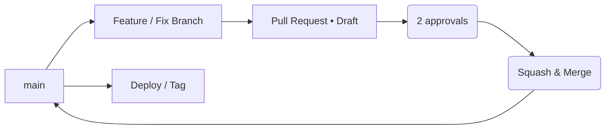

# BRANCH_AND_MERGE_STRATEGY.md  
_Analyst-Agent · Phase-3 · P0/P1 Delivery_  
_Last updated: 01 Jun 2025_

## 1 · Goals
* Ship **P0 (critical)** and **P1 (high)** fixes fast **without blocking** parallel work.  
* Keep **main** always green (CI passes, deployable).  
* Minimise merge conflicts through clear ownership & short-lived branches.

---

## 2 · Branch Naming Convention

| Prefix | Usage | Example |
|--------|-------|---------|
| `fix/`  | Bug fix or refactor | `fix/P0-1-codegen-results` |
| `feat/` | New feature / enhancement | `feat/P1-2-policydocs-vector` |
| `chore/`| Tests, docs, infra | `chore/P1-4-test-coverage` |

Format: `prefix/<task-id>-<slug>` where **task-id** matches plan.

---

## 3 · Branch Lifecycle



1. **Create branch** from latest `origin/main`.  
2. **Commit early, push** ‑ CI runs on every push.  
3. **Open PR as _Draft_**; link to P0/P1 item.  
4. When CI ✅ & checklist complete, mark **Ready for Review**.  
5. **Two approvals** (or 1 maintainer) required.  
6. **Squash & merge**; PR title becomes commit message.  
7. **Delete branch** after merge.

---

## 4 · Pull-Request Template (add `.github/pull_request_template.md`)

```
### ☑️ P0/P1 Task
Fixes: P0-1 CodeGenTool Result Integration

### ✨ Changes
- ...

### ✅ Checklist
- [ ] Ruff & mypy pass locally
- [ ] `pytest -q` passes
- [ ] Coverage ≥ target (51 % now, 55 % by P1-4)
- [ ] Updated docs / Memory Bank
- [ ] Added/updated tests
- [ ] CI green

### 📝 Notes for Reviewer
...
```

---

## 5 · CI Validation Gates (GitHub & GitLab)

| Stage | Job | Fails PR if… |
|-------|-----|--------------|
| Lint  | `ruff` | style issues |
| Types | `mypy --strict` | type errors |
| Tests | `pytest` | failures |
| Coverage | `pytest --cov >= threshold` | < threshold* |
| Build | `docker build` | build fails |

_*threshold increments_: 51 % (now) → 55 % after `P1-4`.

---

## 6 · Merge Order (Critical Path)

| Order | Branch (example) | Depends on | Description |
|-------|------------------|------------|-------------|
| 1 | `fix/P0-3-users-migration` | — | Alembic migration |
| 2 | `fix/P0-2-rbac-guard` | 1 | Add RBAC decorators |
| 3 | `fix/P0-1-codegen-results` | 2 | Integrate CodeGenTool output |
| 4 | `feat/P1-1-redis-blacklist` | 2 | Persist JWT blacklist |
| 5 | `feat/P1-2-policydocs-vector` | 3 | Vector retrieval tool |
| 6 | `feat/P1-3-analysis-view` | 3 | Frontend results page |
| 7 | `chore/P1-4-test-coverage` | 4-6 | Raise coverage to ≥55 % |

*Branches 4-6 can run **in parallel** once #3 is merged; merge in listed order to minimise conflicts.*

---

## 7 · Conflict-Free Tips

1. **Rebase daily** onto `main`; resolve minor conflicts early.  
2. **Touch scopes narrowly**: backend vs frontend vs tests.  
3. Put **shared constants** (e.g. contract schemas) in dedicated files; update via separate PR if needed.  
4. For large refactors (e.g., CodeGen contract), land **interfaces first**, then feature work.

---

## 8 · Back-port / Hot-fix Rules

* Any urgent bug discovered in prod branches off `main` as `hotfix/<slug>`  
* Must target **main**, cherry-pick into ongoing feature branches as needed.

---

## 9 · Release Tagging

| Event | Tag |
|-------|-----|
| After P0 merged & CI green | `v0.2.0-rc.1` |
| After all P1 merged & coverage ≥55 % | `v0.2.0` |

Tags trigger Docker image build & push.

---

## 10 · Communication

* Post PR links in **#fraud-agent-dev** Slack.  
* Daily stand-up: who merges what next? blockers?  
* Update **Memory Bank → activeContext.md** after each merge.

_Adhering to this strategy keeps integration pain low and velocity high while we close the critical P0/P1 gaps._  
