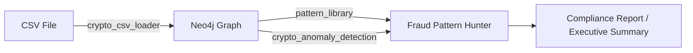

# Crypto Fraud Detection Features

_Last updated: **31 May 2025**_

---

## 1  Overview  

The Phase-2 crypto upgrade adds end-to-end support for detecting on-chain financial crime inside the Analyst-Agent stack.  
Key capabilities delivered:

| Capability | Description |
|-------------|-------------|
| Time-series anomaly detection | ADTK-powered detectors find volume/price spikes, level/volatility shifts and velocity attacks. |
| Graph-pattern detection | 30 + Cypher patterns for wash-trading, pump-and-dump, rug-pulls, flash-loans, sandwich attacks, honeypots, address-poisoning and temporal anomalies. |
| Behavioural clustering | K-Means clusters wallet behaviour, enriched with graph metrics (degree, PageRank, clustering-coef). |
| CSV → Graph ingestion | High-speed loader imports raw blockchain CSVs to Neo4j, auto-creates schema & indexes, calculates derived metrics. |

All features integrate seamlessly with CrewAI agents, Gemini LLM reasoning, Neo4j graph analytics and Prometheus cost metrics.

---

## 2  Tools

### 2.1 CryptoAnomalyTool  

| Aspect | Details |
|--------|---------|
| Path | `backend/agents/tools/crypto_anomaly_tool.py` |
| Dependencies | `adtk`, `networkx`, `scikit-learn`, `matplotlib`, `pandas`, `numpy` |
| Operations | `time_series_anomaly`, `wash_trading`, `pump_and_dump`, `address_clustering`, `graph_metrics`, `all` |
| Data sources | `csv` (local path) or `neo4j` (Cypher query) |
| Output | JSON containing `anomalies`, `summary`, base64 PNG `visualization`, and operation‐specific metadata |

#### Key Detectors
* **Seasonal / Level / Volatility Shift** – ADTK detectors with configurable windows.  
* **Wash-Trading** – circular cycles (length 2–5), self-dealing pairs, balanced volumes.  
* **Pump-and-Dump** – > 100 % price rise + > 200 % volume spike then > 30 % dump.  
* **Address Clustering** – Scaled feature matrix ➜ K-Means ➜ silhouette scoring.  
* **Graph Metrics** – Degree, betweenness, closeness, PageRank, clustering-coef.

#### Minimal Python Usage
```python
from backend.agents.tools.crypto_anomaly_tool import CryptoAnomalyTool
tool = CryptoAnomalyTool()            # Neo4j auto-connect
result = tool.run(
    operation="pump_and_dump",
    data_source="csv",
    data_path="eth_prices_last_30d.csv",
    timestamp_column="timestamp",
    price_column="price_usd",
    volume_column="volume"
)
print(result["summary"])
```

#### CrewAI Function Call Example (inside agent prompt)
```json
{
  "name": "crypto_anomaly_detection",
  "arguments": {
    "operation": "wash_trading",
    "data_source": "neo4j",
    "data_path": "MATCH (t:Transaction)-[:ON_TOKEN]->(:Token {symbol:'XYZ'}) RETURN t",
    "from_address_column": "from",
    "to_address_column": "to",
    "value_column": "value",
    "timestamp_column": "ts"
  }
}
```

---

### 2.2 CryptoCSVLoaderTool  

| Aspect | Details |
|--------|---------|
| Path | `backend/agents/tools/crypto_csv_loader_tool.py` |
| CSV formats | `eth_transactions`, `token_transfers`, `dex_trades`, `address_data`, `custom` |
| Features | Batch import, automatic schema / index creation, derived address metrics, validation & profiling, optional metrics calculation |
| Output | Import statistics (`processed_rows`, `error_rows`, success rate %, rows/sec), schema info, metric summary |

#### Minimal Python Usage
```python
from backend.agents.tools.crypto_csv_loader_tool import CryptoCSVLoaderTool
loader = CryptoCSVLoaderTool()
stats = loader.run(
    operation="load_csv",
    csv_path="uniswap_trades.csv",
    csv_format="dex_trades",
    batch_size=2000,
    create_schema=True,
    calculate_metrics=True
)
print(stats["summary"])
```

---

## 3  Fraud Pattern Library (30 + patterns)

Patterns are defined in `backend/agents/patterns/crypto_fraud_patterns.yaml`.  
Structure per pattern:

```yaml
- id: "WASH_TRADING_CIRCULAR"
  name: "Circular Wash Trading"
  category: "WASH_TRADING"
  risk_level: "HIGH"
  detection:
    type: "CYPHER"
    query: |
      MATCH path = (a:Address)-[:TRANSFERS*2..5]->(a)
      ...
```

### Categories & Count

| Category | Patterns | Examples |
|----------|----------|----------|
| Wash-Trading | 3 | Circular, Self-Dealing, Volume Manipulation |
| Pump-and-Dump | 3 | Price Spike, Coordinated Buying, Insider Selling |
| Rug Pull | 3 | Liquidity Removal, Abandoned Project, Team Token Dump |
| Flash Loan | 2 | Direct Attack, Price Manipulation |
| Sandwich Attack | 2 | Single, Repeat Offender |
| Address Poisoning | 2 | Single, Campaign |
| Honeypot Token | 2 | No-Sell, Failed Sells |
| Time-Based Anomalies | 3 | Velocity, Rapid Movement, Abnormal Timing |

_Total patterns: **30**_

### Pattern Usage (via PatternLibraryTool)

```json
{
  "name": "pattern_library",
  "arguments": {
    "pattern_id": "WASH_TRADING_CIRCULAR",
    "parameters": {
      "min_cycle_value": 5000,
      "time_window_days": 3
    }
  }
}
```

The tool fills parameters, executes Cypher on Neo4j, and returns matched sub-graphs.

---

## 4  Integration Notes

| Component | Interaction |
|-----------|-------------|
| **CrewFactory** | Registers `crypto_anomaly_detection` & `crypto_csv_loader` as Tools available to the `fraud_pattern_hunter` agent. |
| **FraudPatternHunter Agent** | Combines PatternLibraryTool, FraudMLTool and CryptoAnomalyTool for multi-modal detection. |
| **Neo4j** | CSV loader populates graph; anomaly tool queries via Cypher or raw DataFrame; graph metrics use NetworkX on exported sub-graph. |
| **E2B Sandbox** | CodeGenerationTool ➜ Python snippets ➜ SandboxExecutionTool for heavy ML or plotting. |
| **Prometheus Metrics** | Tool calls counted in `llm_tokens_used_total`, `llm_cost_usd_total`; loader exposes rows/sec gauge. |

---

## 5  Usage Workflow



1. **Ingest** – Load raw Parquet/CSV blockchain data → Neo4j.  
2. **Detect** – Run pattern queries & anomaly tool on same graph.  
3. **Investigate** – GraphVisualization UI highlights suspicious cycles/events.  
4. **Report** – TemplateEngineTool generates Markdown/PDF for auditors.

---

## 6  Future Enhancements

| Idea | Benefit |
|------|---------|
| Real-time stream adapter (Kafka → loader) | Continuous monitoring instead of batch CSV |
| GDS algorithms (Node2Vec, Community Detect) | Improve address clustering & label propagation |
| Explainability layer (SHAP for ML models) | Transparent risk scoring for compliance |
| Alerting webhook (Slack / e-mail) | Immediate notification of high-risk patterns |
| Multi-chain support (BTC, Solana) | Extend detectors & loader schemas |
| Auto-tuning thresholds via Gemini Pro agent | Adaptive detection sensitivity |
