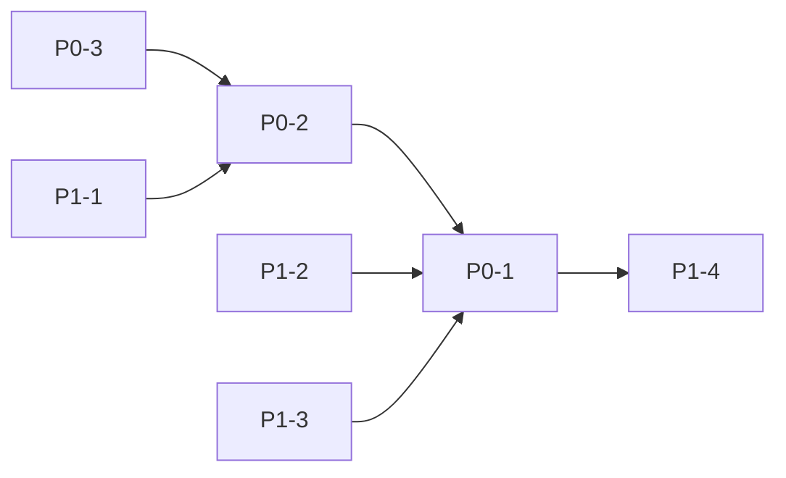

# P0 & P1 Implementation Plan  
_Analyst-Agent · Phase-3 Kick-off · 01 Jun 2025_

This plan closes all **P0 (Critical)** and **P1 (High Priority)** gaps surfaced in the gap analysis.  
Legend 🟢 quick-win 🟡 standard 🔴 blocker

---

## 1 · Priority Matrix

| ID | Gap / Deliverable | Priority | Owner | Effort* | Status |
|----|-------------------|----------|-------|---------|--------|
| P0-1 | **Integrate CodeGenTool results into crew pipeline** | P0 | backend | 8 h | ⬜ |
| P0-2 | **Add RBAC guard to `/crew/run` & `/analysis/*`** | P0 | backend | 2 h | ⬜ |
| P0-3 | **Generate & apply Alembic migration for `users` table** | P0 | backend | 1 h | ⬜ |
| P1-1 | **Persist JWT blacklist in Redis** | P1 | backend | 4 h | ⬜ |
| P1-2 | **Implement PolicyDocsTool vector retrieval** | P1 | backend | 12 h | ⬜ |
| P1-3 | **Build Front-end Analysis Results View** | P1 | frontend | 16 h | ⬜ |
| P1-4 | **Raise test coverage to ≥ 55 %** | P1 | dev-ex | 12 h | ⬜ |

_\*Effort = focused engineer hours (1 d ≈ 6 productive h)_  

---

## 2 · Task Breakdown & Implementation Steps

### P0-1 · CodeGenTool Result Integration 🟡
1. **Define result contract** in `backend/agents/tools/code_gen_tool.py` (`Dict[str, Any]` with `result`, `artifacts`, `plots`).
2. **Modify SandboxExecTool** to return stdout/stderr + file artifacts (e.g. PNG, CSV) via base64.
3. **Update CrewFactory** post-task hook to _merge_ `code_gen_output` into `crew_context`.
4. **Extend ReportWriter prompts/templates** to include charts or result summaries if present.
5. **Add `tests/test_code_gen_integration.py`**:
   - Unit: mock e2b returning `{result:42}` → assert crew_context merge.
   - Integration: run mini-crew with CodeGenTool → Report contains “42”.
6. **Docs**: update `systemPatterns.md` §5 path.

### P0-2 · RBAC Guard on Sensitive Endpoints 🟢 quick-win
1. In `backend/auth/dependencies.py` expose `require_roles(["analyst","admin"])`.
2. Decorate `/crew/run`, `/analysis/*` routes.
3. **Tests** `test_rbac.py`:
   - Authorized = 200, Unauthorized = 403.
4. Verify Postman smoke test.

### P0-3 · Alembic Migration for `users` Table 🟢 quick-win
1. `alembic revision --autogenerate -m "users table"`; inspect & commit.
2. CI: add `alembic upgrade head` to `pytest` job pre-step (uses SQLite memory).
3. Docker compose: `command: ["alembic","upgrade","head","&&","uvicorn",...]`
4. **Tests**: start app → assert `users` exists.

### P1-1 · Redis JWT Blacklist Persistence 🟡
1. Add `redis.asyncio` client init in `backend/auth/jwt_handler.py`.
2. Move in-memory set → Redis `SETBLK` (`token:exp`).
3. Expiry via `EXPIRE` at token TTL.
4. **Config**: new env `REDIS_URL`; default to `redis://redis:6379/0`.
5. **Tests**: mock Redis; blacklist then validate reject.

### P1-2 · PolicyDocsTool Vector Retrieval 🔴
1. **Corpus ingestion script**: load PDF/MD policy docs → split → embed with Gemini → store in Redis + metadata.
2. **tool/policy_docs_tool.py**
   - `embed_query` → similarity top-k.
   - Return relevant excerpts.
3. **ComplianceChecker prompt**: insert `{{policy_excerpts}}`.
4. **Tests**:
   - Embed & retrieve stub doc.
   - End-to-end: compliance_checker gets excerpt.

### P1-3 · Front-end Analysis Results View 🟡
1. Route `/dashboard/analysis/[taskId].tsx`.
2. Fetch `/api/v1/analysis/{taskId}`.
3. Components:
   - Summary cards (risk, patterns).
   - GraphVisualization reuse.
   - Markdown report render.
4. **vis-network** schema validation.
5. **Playwright** E2E: run crew ⇒ page shows risk score.

### P1-4 · Raise Test Coverage to ≥ 55 % 🟡
1. Add missing tool tests (CodeGenTool, PolicyDocsTool).
2. Front-end Jest tests for GraphVisualization filters.
3. Playwright happy path for Analysis View.
4. Update CI coverage gate `pytest --cov-fail-under=55`.

---

## 3 · Dependency Graph

*Migration (P0-3) must land before enhanced RBAC tests; CodeGen result contract (P0-1) unblocks PolicyDocsTool prompts and new UI.*

---

## 4 · Order of Implementation

| Order | Task | Rationale |
|-------|------|-----------|
| 1 | **P0-3** Alembic migration | Enables DB-backed auth in all envs |
| 2 | **P0-2** RBAC guard | Low-risk security fix; validates migrations |
| 3 | **P0-1** CodeGenTool result flow | Largest refactor; unblock downstream |
| 4 | **P1-1** Redis blacklist | Secures sessions before new UI |
| 5 | **P1-2** PolicyDocsTool retrieval | Depends on CodeGenTool contract for report updates |
| 6 | **P1-3** Front-end Analysis View | Requires enriched responses |
| 7 | **P1-4** Coverage uplift | Final pass after code stabilises |

---

## 5 · Testing Requirements Summary

| Task | Unit Tests | Integration | E2E | Coverage Delta |
|------|------------|-------------|-----|----------------|
| P0-1 | ✔ | ✔ Crew run | – | +3 % |
| P0-2 | ✔ decorator | ✔ API auth | – | +1 % |
| P0-3 | ✔ migration | – | – | +0 % |
| P1-1 | ✔ redis mock | ✔ login/logout | – | +1 % |
| P1-2 | ✔ embed & query | ✔ compliance flow | – | +2 % |
| P1-3 | Jest components | – | ✔ Playwright | +2 % |
| P1-4 | — | — | — | +6 % (aggregate) |

---

## 6 · Quick Wins (≤ 2 h)

1. **RBAC decorators on `/crew/run` & `/analysis`** (P0-2).  
2. **Alembic auto-migration commit** (P0-3).  
3. **Add failing test for CodeGenTool missing result**—establish red-green TDD.  
4. **CI change**: enforce `pytest --cov-fail-under=51` now to prevent regressions.

---

## 7 · Roll-out & Risk Mitigation

| Risk | Mitigation |
|------|------------|
| Breaking crew pipeline with CodeGen refactor | Feature-flags: `ENABLE_CODEGEN_RESULTS` env, default off until P1-3 done |
| Redis downtime blocking auth | Fallback to in-memory blacklist with warning |
| Alembic migration failure in prod | Dry-run in staging DB; include downgrade script |
| Coverage gate failures | Increment threshold gradually (51 % → 55 %) |

---

### Next Steps

1. Assign owners & create GitHub issues with tags `P0`, `P1`.  
2. Branch naming convention: `fix/P0-1-codegen-results`, etc.  
3. Daily stand-up: track burndown against effort (≈ 55 h total).  

_Stay green, ship fast, document every change in **Memory Bank**._  
