# Pattern Library – Implementation Guide

_Last updated: **30 May 2025**_

---

## 1 · Overview & Purpose  
The **Pattern Library** is a structured knowledge-base of financial-crime motifs (structuring, layering, mixing, etc.) expressed in machine-readable YAML.  
It gives agents – primarily **`fraud_pattern_hunter`** – a deterministic way to:

* recognise _known_ illicit behaviours by matching pre-defined sub-graphs  
* generate parameterised Cypher queries instead of free-form LLM code  
* attach consistent metadata (risk, regulations, recommended actions) to every hit  

The library complements anomaly-detection logic by providing high-precision “if-this-then-that” rules that regulators and auditors can review.

---

## 2 · Key Architecture Decisions  

| Decision | Rationale |
|----------|-----------|
| **YAML on disk** | Version-controlled, human-readable, diff-able in PRs. |
| **Single canonical schema** (`fraud_motifs_schema.yaml`) | Guarantees every pattern has the same required metadata & detection blocks. |
| **Dual conversion paths** (template _vs_ dynamic) | 90 % of cases use a hand-crafted `cypher_template`; dynamic builder covers exotic motifs. |
| **Tool abstraction** (`PatternLibraryTool`) | Keeps conversion logic outside agents, easier unit-testing & hot-swapping. |
| **In-memory cache + 5 min TTL** | Instant access during crew runs while allowing re-load without restart. |

---

## 3 · YAML Schema Primer  

```yaml
metadata:            # Required descriptive block
  id: STRUCT_001     # Unique ID (regex ^[A-Z]+_\d{3}$)
  name: …            # Human title
  category: …        # Enumerated (STRUCTURING, LAYERING…)
  risk_level: HIGH   # LOW / MEDIUM / HIGH / CRITICAL
  tags: […]          # Keyword array
  regulatory_implications:
    - "SAR filing required"

detection:           # How to find the motif
  graph_pattern:     # Nodes / relationships / path patterns
  temporal_constraints:
  value_constraints:
  aggregation_rules:
  additional_conditions: "Cypher WHERE …"

cypher_template: |   # Optional – ready-to-run Cypher with $params

response_actions:    # What to do when detected
  - action: ALERT
    priority: HIGH
```

See the full schema in `backend/agents/patterns/fraud_motifs_schema.yaml`.

---

## 4 · Pattern → Cypher Conversion Flow  

1. `fraud_pattern_hunter` calls **`PatternLibraryTool.convert_pattern()`** with:
   * `pattern_id`
   * user parameters (e.g., thresholds)
   * `use_template` flag  
2. Tool logic:  
   a. Loads / caches YAML → dict  
   b. If `use_template` and `cypher_template` present → substitute `$params`.  
   c. Else runs **dynamic builder**  
      * parses `graph_pattern` → `MATCH`  
      * appends `WHERE` clauses from value & temporal constraints  
      * stitches `WITH/HAVING` for aggregations  
3. Returns `{ cypher_query, parameters }` – ready for `GraphQueryTool`.

---

## 5 · Integration with `fraud_pattern_hunter` Agent  

```mermaid
sequenceDiagram
    fraud_pattern_hunter->>PatternLibraryTool: convert_pattern(STRUCT_001,…)
    PatternLibraryTool->>GraphQueryTool: run_query(cypher, params)
    GraphQueryTool-->>PatternLibraryTool: records
    PatternLibraryTool-->>fraud_pattern_hunter: rows + metadata
    fraud_pattern_hunter->>report_writer: summary, risk_score
```



The hunter may delegate heavy ML tasks to `sandbox_coder` _after_ pattern results for deeper anomaly scoring.

---

## 6 · Adding New Patterns  

1. Copy `fraud_motifs_schema.yaml#example_patterns` into a new file under `backend/agents/patterns/`.  
2. Fill the `metadata` block; ensure `id` is unique.  
3. Define either:
   * **`cypher_template`** – quickest, most transparent, or  
   * `detection.graph_pattern` + constraints for dynamic generation.  
4. Commit & open PR – unit-tests will load and validate YAML on CI.  
5. (Optional) add a short entry to `docs/pattern_catalog.md`.

---

## 7 · Examples  

### 7.1 List Patterns  
```python
tool = PatternLibraryTool()
print(tool.list_patterns())        # summaries
```

### 7.2 Search by Category & Tag  
```python
tool.search_patterns(category="STRUCTURING", tags=["tax_evasion"])
```

### 7.3 Convert to Cypher (Template)  
```python
result = tool.convert_pattern(
    "STRUCT_001",
    parameters={"min_amount":8000,"threshold":10000,"time_window":"P7D","min_transactions":3},
    use_template=True
)
run_cypher(result["cypher_query"], result["parameters"])
```

### 7.4 Dynamic Build  
```python
tool.convert_pattern("LAYER_001", {"min_ratio":0.9,"max_days":2}, use_template=False)
```

---

## 8 · Testing Approach  

* **Unit tests** in `tests/test_pattern_library_tool.py` (≈ 250 cases) cover:
  * Loading & caching logic
  * Schema compliance & error handling
  * Search filters (ID, category, risk, tags, regulations)
  * Graph/value/temporal/aggregation conversion helpers
  * Template vs dynamic Cypher output
  * `_run()` entry-point actions (`list`, `get`, `search`, `convert`)
* **CI** runs `pytest -m "not e2e"` in matrix (py39-py311).
* Future E2E: spin Neo4j test container, assert query returns expected rows.

---

## 9 · Future Enhancements  

| Idea | Benefit |
|------|---------|
| **Schema JSON-Schema validation** in pre-commit | Fail fast on malformed patterns |
| **Graph-aware LLM suggestions** | Auto-draft new patterns from natural language |
| **Pattern versioning & deprecation tags** | Audit-ready lineage |
| **Risk-weighted similarity search** | Recommend related motifs for novel anomalies |
| **Metrics** `pattern_matches_total{pattern_id}` | Prometheus alerting on surge in hits |
| **Visual builder UI** | Drag-and-drop nodes/edges → YAML export |
| **Multi-DB support** | Generate SQL / Gremlin alongside Cypher |

---

### 📂 File: `PATTERN_LIBRARY_IMPLEMENTATION.md`  
This doc lives alongside `PROMPT_MANAGEMENT_IMPLEMENTATION.md` and is required reading for new contributors working on fraud detection logic.
